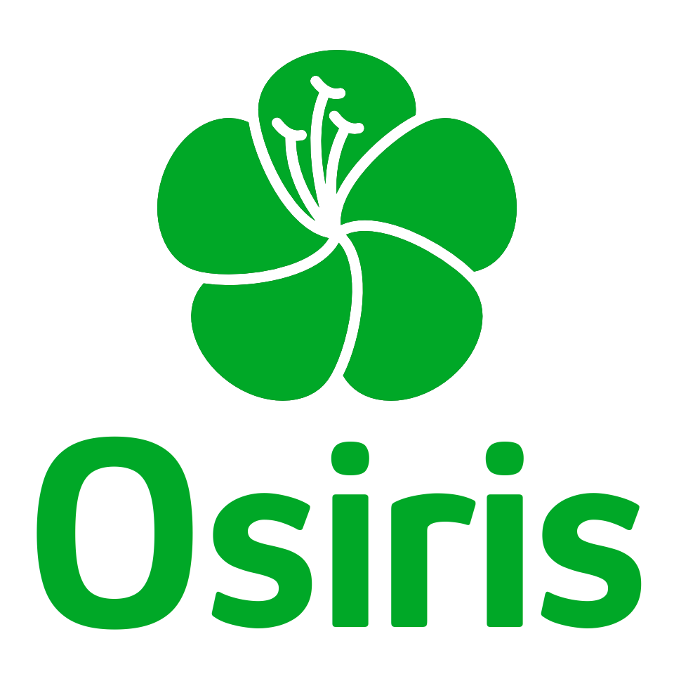

<div align="center">
   
</div>

<div align="center">
   
    
   
   
   

</div>

Osiris é um projeto de graduação em andamento que promove uma alimentação mais saudável por meio do uso de Plantas Alimentícias Não Convencionais (PANCs). Ele fornece informações de cultivo, diversas receitas e permite que os usuários criem suas próprias receitas.

---

# Tecnologias utilizadas

  

---

# Guia de execução

Este guia fornece instruções passo a passo sobre como configurar e executar a aplicação mobile. Certifique-se de seguir todas as etapas para garantir uma execução suave do projeto.

## Requisitos prévios

Antes de começar, certifique-se de ter as seguintes ferramentas instaladas em seu sistema:

- **NPM:** Para inicializar o app é preciso rodar a aplicação, e para isso é necessário ter instalado o [Node Package Manager (NPM)](https://nodejs.org/en).
- **Expo GO**: Um dispositivo móvel (Android/IOS) com o aplicativo Expo GO instalado, ou um emulador em seu computador.
- **Git**: É necessário ter o [Git](https://www.git-scm.com/) instalado em sua máquina para clonar o projeto.

---

## Rodando a aplicação

1. Clone o repositório:

   ```bash
   git clone https://github.com/davitorress/Osiris-react.git
   ```

2. Instalação das dependências:

   ```bash
   npm install
   ```

3. Para inicializar o App:

   Modo desenvolvedor:

   ```bash
   npm run dev
   ```

   Modo produtivo:

   ```bash
   npm start
   ```

4. Abra o aplicativo **Expo GO** em seu dispositivo móvel escaneando o QR Code que irá aparecer no terminal ou pressione a tecla "a" para abrir o emulador android.
   Obs.: É necessário que o seu celular e o computador estejam na mesma rede wi-fi.
